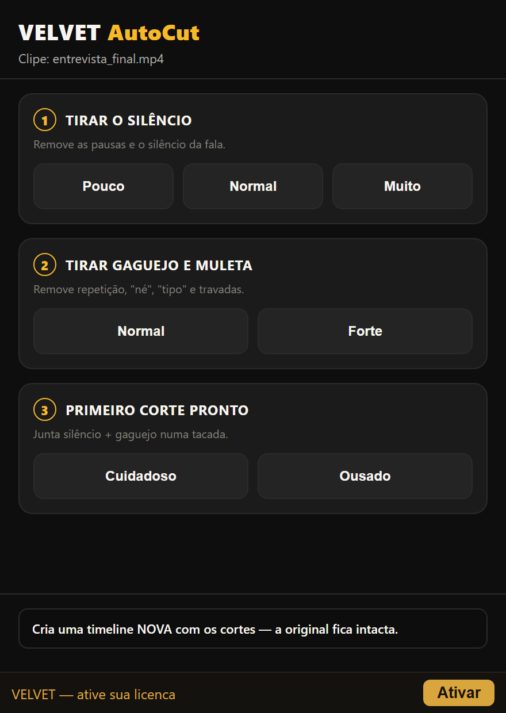
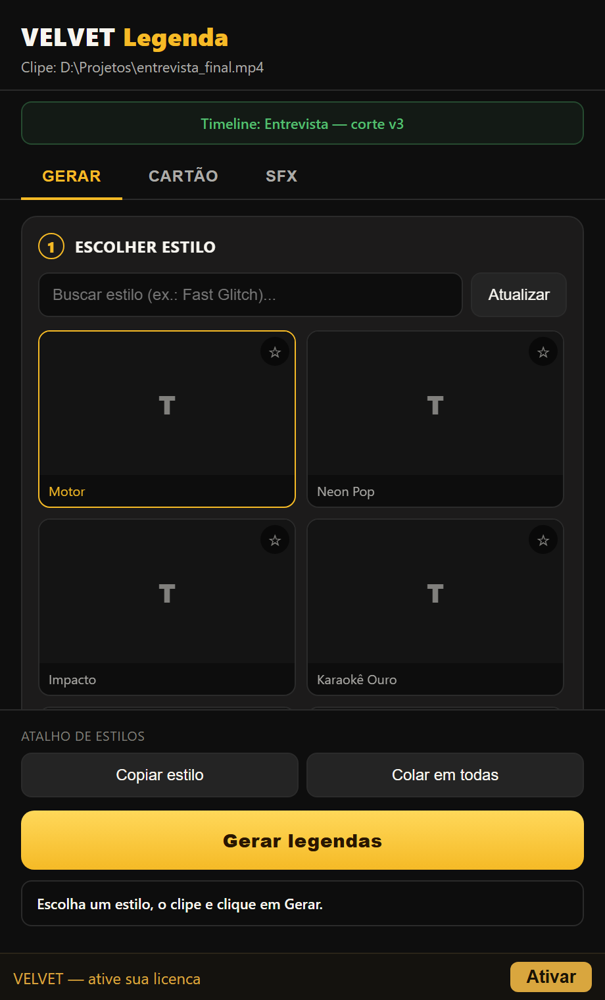
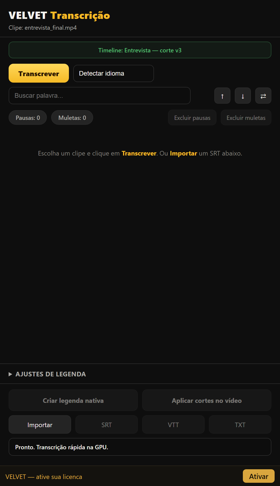
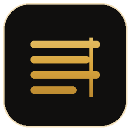

# VELVET

**Esteira de looks pro seu vídeo: do app direto pro DaVinci Resolve, sem retrabalho.**

&nbsp;

---

Color grading é onde o vídeo ganha (ou perde) a cara de cinema, e é onde amador e profissional mais perdem tempo. O **VELVET** é uma sala de cor num app só: escolhe a câmera, aplica um look, dosa a força e joga o grade pronto **direto na timeline do DaVinci Resolve**. Nada de arrastar LUT, empilhar nó atrás de nó e refazer tudo no próximo clipe.

Uma esteira: **do app → pro Resolve**, com o processo de colorista já embutido, não a imagem crua com uma cor chapada por cima.

## O que faz

- **Biblioteca de looks prontos:** 22 looks curados (Neutro, Institucional, Cinematic, Teal & Orange, Quente Premium, Frio Clean, High-Key, Golden Hour, Preto e Branco, Cold Thriller, Bleach Bypass, Cross Process, Retro 70s/80s, Pastel e mais), organizados entre *Base* e *Criativo*. Um clique parte de uma base já tratada, não da imagem crua.
- **Câmera de origem em um toque:** normaliza o material LOG/HDR pro Rec.709 (gamma **e** gamut, como um CST de verdade): Rec.709, Sony S-Log2/S-Log3, Panasonic V-Log, DJI D-Log, ARRI LogC3/LogC4, Canon C-Log/C-Log2/C-Log3, Fuji F-Log/F-Log2, Apple Log, **Samsung Log** (raro, quase nenhuma ferramenta tem), Nikon N-Log, RED Log3G10, GoPro, HLG, PQ HDR, ACES e DaVinci Intermediate. 24 perfis.
- **Integração direta com o DaVinci Resolve:** o app conversa com o Resolve e monta o grade nos nós por você. Você continua editando; a cor chega pronta.
- **Do app pro timeline, sem retrabalho:** configurou uma vez, o look viaja pro projeto. Sem exportar `.cube` na mão, sem reconstruir o mesmo tratamento clipe a clipe.
- **Modo Amador e Modo Pro no mesmo app:** simples por padrão (câmera → look → intensidade); e quando quiser, o Pro abre rodas de cor (Lift/Gamma/Gain/Offset), curvas, HSL por faixa e acabamento de filme (halação, grão, bloom, vinheta).
- **Antes / Depois de verdade:** comparador com slider na imagem inteira, pra julgar o grade na hora.
- **Escopos com leitura real:** waveform, parade, vetorscópio e histograma medidos do clipe, não de enfeite.
- **VELVET AI (exclusivo):** digita a **intenção** em português ("quente nostálgico anos 80", "clean corporativo", "teal cinema"); a IA lê os escopos e decide o grade, e explica o que mudou, pra você aprender em vez de seguir às cegas.

## Por que VELVET

A maioria das ferramentas "one click" do mercado (tipo OneClick Grade, US$ 37–89) é, no fundo, **uma LUT + um slider de intensidade**. Ficam bonitas num clipe e quebram no próximo, porque não tem processo de cor por baixo: é cor chapada sobre imagem crua.

O VELVET foi construído ao contrário:

| | Ferramentas "one click" | **VELVET** |
|---|---|---|
| Base do look | LUT fixa | Motor de cor procedural (ombro fílmico, contraste com pivô na pele, 3-way, densidade, proteção de pele) |
| Conversão de câmera | Lista de LUTs | Conversão real de gamma **+ gamut**, 20+ perfis |
| Controle | 1 slider | Amador simples **ou** Pro completo, no mesmo app |
| Inteligência | Nenhuma | IA lê os escopos + a sua intenção e explica o grade |
| Entrega | Você arrasta a LUT | Vai **direto pra timeline** do Resolve |

Resultado: sai de material cru pra um grade profissional em segundos, com processo de colorista, não um filtro por cima.

## Modo Pro

Rodas de cor, curvas e HSL por faixa, acabamento de filme (halação · grão · bloom · vinheta) e escopos: a profundidade de uma sala de cor, sem sair do fluxo.

## A suíte VELVET: não é só cor

VELVET virou uma **suíte de edição pro DaVinci Resolve**. Além do app de cor, três plugins nativos que instalam num pack só e aparecem **separados** no menu de Integrações: cada um com seu ícone, cada um uma função (nada de canivete suíço que faz tudo mal).

-  **VELVET AutoCut:** corta silêncio, gaguejo e take repetido em segundos, sem sair do DaVinci. Presets Pouco / Normal / Muito. A timeline original fica intacta.
-  **VELVET Transcrição:** edite pelo **texto** como no Premiere, com transcrição por IA rodando **na sua GPU** (Whisper local): sem nuvem, sem limite de horas, sem custo por minuto. Excluir texto corta o vídeo (ripple), localizar/substituir, exportar SRT.
-  **VELVET Legenda:** legenda viral com **karaokê**, biblioteca de SFX e **34 letterings próprios**, nativa no Resolve. O que o CaptionFlow faz no Premiere, aqui com transcrição embutida.

### Por que VELVET (e não os outros)

Nenhum concorrente junta as quatro coisas: **DaVinci-nativo + em português + compra única + IA 100% local**. Os pagos de legenda BR (CaptionFlow, Legendas Master) só rodam no Premiere; os de DaVinci (AutoCut.com, FireCut) são **assinatura mensal**. VELVET é compra única e a IA roda no seu PC.

| | Concorrentes | **VELVET** |
|---|---|---|
| Onde roda | Premiere (os BR) ou assinatura | **DaVinci nativo, compra única** |
| Transcrição | nuvem, por minuto/limite de horas | **sua GPU (Whisper local), ilimitada** |
| Idioma | inglês | **português** |
| Preço | US$10-20/mês recorrente | **paga uma vez, é seu** |

### Preços (lançamento)

Cada ferramenta é **avulsa** (chave própria) ou junte num **combo** e economize:

| Produto | Preço | Comprar |
|---|---|---|
| VELVET AutoCut | R$67 | [comprar](https://paulocodex.com/comprar?product=velvet-autocut) |
| VELVET Transcrição | R$97 | [comprar](https://paulocodex.com/comprar?product=velvet-transcricao) |
| VELVET Legenda | R$137 | [comprar](https://paulocodex.com/comprar?product=velvet-legenda) |
| VELVET Color | R$147 | [comprar](https://paulocodex.com/comprar?product=velvet) |
| **VELVET Suíte** (os 3 plugins) | **R$197** (economize R$104) | [comprar](https://paulocodex.com/comprar?product=velvet-suite) |
| **VELVET Complete** (tudo + Color) | **R$297** (economize R$151) | [comprar](https://paulocodex.com/comprar?product=velvet-complete) |

Compra única, 2 PCs por licença, atualizações inclusas.

**Todos os planos numa página:** [paulocodex.com/velvet](https://paulocodex.com/velvet)

## Como funciona: você grada num NÓ, ao vivo

Nada de "importar arquivo". O VELVET trabalha no **seu clipe**, dentro do DaVinci, na página **Color**, igual aos grandes (RapidGrade, Colourlab). Duas portas, as duas caem num **nó**:

- **Modo direto (manual/pro):** na página Color, adicione o VELVET num nó (ResolveFX Color → DaVinci CTL → `VELVET_Core`). Aparecem **22 looks + sliders** (exposição, temperatura, contraste, film look, proteção de pele) gradando **ao vivo na sua imagem**.
- **Modo IA (1 clique):** abra o **app VELVET** e ele lê o frame do seu clipe, decide o look **citando a referência** e **monta o nó pra você**.

Depois é só ajustar os sliders no próprio nó e finalizar no Resolve.

## Baixar, instalar e usar

**Requisito:** DaVinci Resolve **Studio** (os plugins de Integração de Fluxo de Trabalho só existem no Studio) · Windows 10/11. O instalador **já traz tudo embutido** (IA de transcrição + ffmpeg): você **não** instala Python nem nada.

**Instalar (uma vez, ~2 min):** baixe o `VELVET-Plugins-Setup.zip` em **[Releases](../../releases)**, **feche o DaVinci**, extraia e rode o `INSTALAR.bat`. Reabra o Resolve → os 3 aparecem **separados** em **Área de trabalho › Integrações de Fluxo de Trabalho** (VELVET AutoCut · Legenda · Transcrição). *(O `.exe` do VELVET Color também está nos Releases, instala à parte.)*

**Testar e ativar:** 3 dias grátis ao abrir. Para liberar, clique em **Ativar** na barra de baixo do plugin e cole sua chave (veio na compra + e-mail; 1 chave = 2 PCs; Suíte/Complete ativam os 3 com a mesma chave).

**Usar cada um (individual):**
- **AutoCut:** clique no clipe na timeline → escolha o corte (silêncio / muleta / take repetido) → **Cortar**. Sai uma timeline nova já cortada; a original fica intacta.
- **Legenda:** importe um SRT (ou gere no Transcrição) → clique no clipe → escolha o estilo (34 letterings) → opcional SFX + karaokê → **Gerar legendas**. Aba **Cartão** = lower third (nome + função).
- **Transcrição:** clique no clipe → **Transcrever** (IA roda na sua GPU; baixa o modelo 1× no 1º uso) → edite pelo **texto** (apagar corta o vídeo, buscar/substituir, remover pausas/muletas) → aplique a legenda ou exporte SRT/VTT/TXT.

Guia completo dentro do `.zip` (`LEIA-ME.txt`). Dúvidas: **contato@paulocodex.com**.

## Status

**Beta: motor provado, lançamento em breve.** O núcleo de cor passa em **52/52 provas numéricas** contra referências publicadas (WB Bradford vs Lindbloom, PQ/ST.2084, LUT oficial de Samsung Log) e já foi **validado rodando no DaVinci Resolve Studio 21** (aplica o grade no nó e renderiza na GPU de verdade, não "compila", *funciona*). Compra única, 100% offline, em português. Este repositório é a **apresentação pública**; o código-fonte é fechado.

Quer ser avisado quando abrir?

**[paulocodex.com/p/velvet](https://paulocodex.com/p/velvet)**

## Feito pra rodar em

- **DaVinci Resolve 18.6–21** (Free e Studio)
- **Windows** e **macOS**
- Interface **em português**, do amador ao profissional

## 🥷 Mascote

Todo projeto do estúdio tem o **ninja Codex** na cor da sua identidade: o mesmo mascote da casa, recolorido pro tema do **Velvet**.

 

## Sobre o desenvolvedor

**Paulo Adriel** é produtor de vídeo e desenvolvedor indie brasileiro. Construo o produto **e** a apresentação dele (código + identidade visual, motion e material de lançamento) do zero ao ar em 30 dias. Trabalho de forma aberta e escuto quem usa. Estúdio [**Paulocodex**](https://paulocodex.com).

 

---

📧 [contato@paulocodex.com](mailto:contato@paulocodex.com) &nbsp;·&nbsp; 🌐 [paulocodex.com](https://paulocodex.com) &nbsp;·&nbsp; 📸 [Instagram](https://instagram.com/paulodev.codex) &nbsp;·&nbsp; 💼 [LinkedIn](https://www.linkedin.com/in/paulo-adriel/) &nbsp;·&nbsp; 🐙 [github.com/Paulothedeveloper](https://github.com/Paulothedeveloper)

_Repositório de **apresentação pública**: o código-fonte é fechado. Nada de dado ou segredo aqui._

