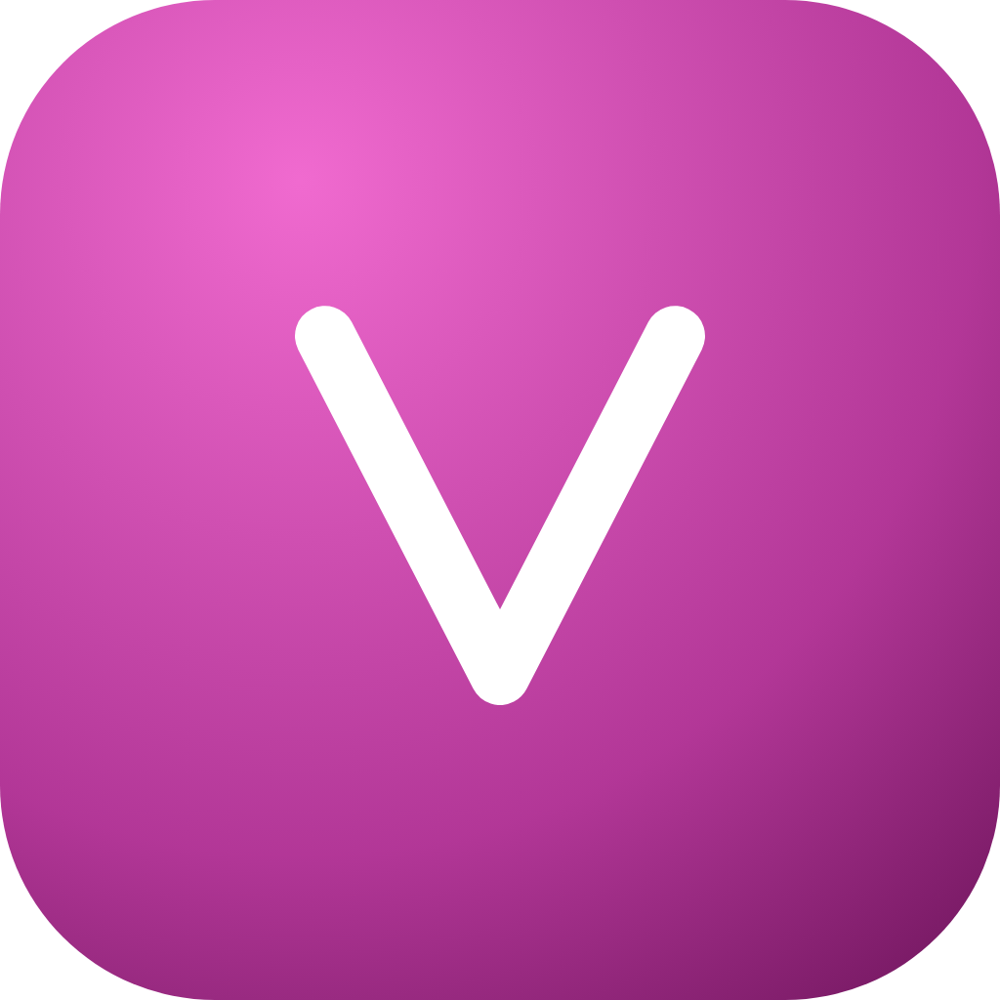
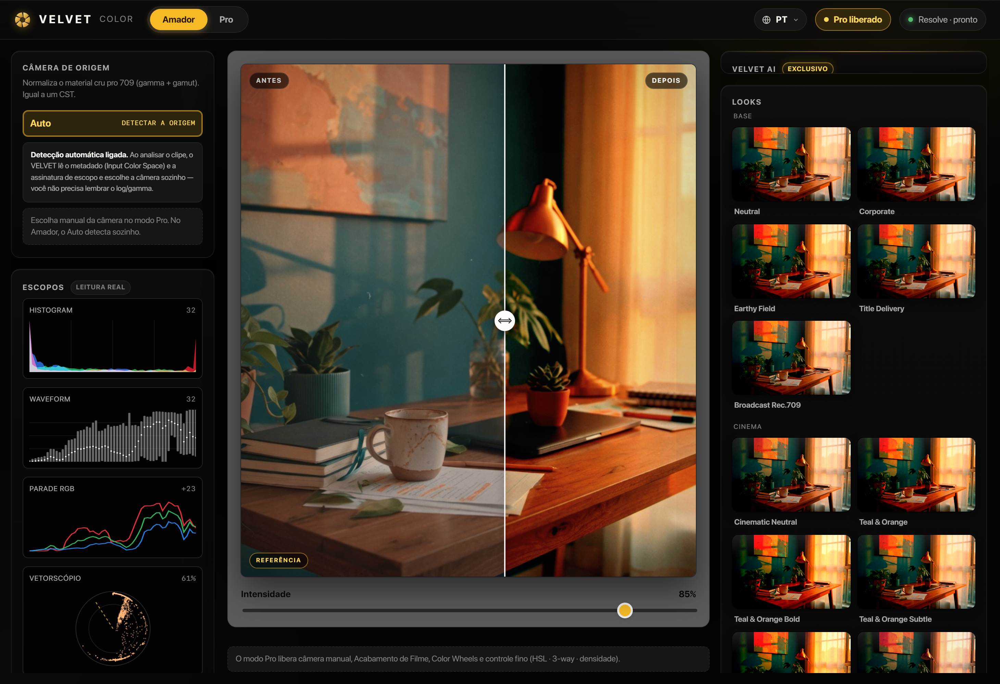
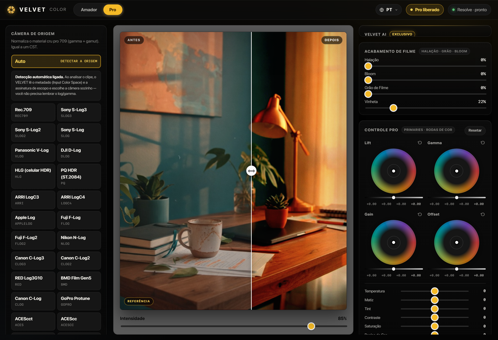

# VELVET

**Esteira de looks pro seu vídeo — do app direto pro DaVinci Resolve, sem retrabalho.**

&nbsp;

---

Color grading é onde o vídeo ganha (ou perde) a cara de cinema — e é onde amador e profissional mais perdem tempo. O **VELVET** é uma sala de cor num app só: escolhe a câmera, aplica um look, dosa a força e joga o grade pronto **direto na timeline do DaVinci Resolve**. Nada de arrastar LUT, empilhar nó atrás de nó e refazer tudo no próximo clipe.

Uma esteira: **do app → pro Resolve**, com o processo de colorista já embutido — não a imagem crua com uma cor chapada por cima.

## ✨ O que faz

- **Biblioteca de looks prontos** — 12 looks curados (Neutro, Institucional, Cinematic, Teal & Orange, Quente Premium, Frio Clean, High-Key, Golden Hour, Preto e Branco e mais), organizados entre *Base* e *Criativo*. Um clique parte de uma base já tratada, não da imagem crua.
- **Câmera de origem em um toque** — normaliza o material LOG/HDR pro Rec.709 (gamma **e** gamut, como um CST de verdade): Rec.709, Sony S-Log2/S-Log3, Panasonic V-Log, DJI D-Log, ARRI LogC3/LogC4, Canon C-Log/C-Log2/C-Log3, Fuji F-Log/F-Log2, Apple Log, Nikon N-Log, RED Log3G10, GoPro, HLG, PQ HDR, ACES e DaVinci Intermediate. Mais de 20 perfis.
- **Integração direta com o DaVinci Resolve** — o app conversa com o Resolve e monta o grade nos nós por você. Você continua editando; a cor chega pronta.
- **Do app pro timeline, sem retrabalho** — configurou uma vez, o look viaja pro projeto. Sem exportar `.cube` na mão, sem reconstruir o mesmo tratamento clipe a clipe.
- **Modo Amador e Modo Pro no mesmo app** — simples por padrão (câmera → look → intensidade); e quando quiser, o Pro abre rodas de cor (Lift/Gamma/Gain/Offset), curvas, HSL por faixa e acabamento de filme (halação, grão, bloom, vinheta).
- **Antes / Depois de verdade** — comparador com slider na imagem inteira, pra julgar o grade na hora.
- **Escopos com leitura real** — waveform, parade, vetorscópio e histograma medidos do clipe, não de enfeite.
- **VELVET AI (exclusivo)** — digita a **intenção** em português ("quente nostálgico anos 80", "clean corporativo", "teal cinema"); a IA lê os escopos e decide o grade — e explica o que mudou, pra você aprender em vez de seguir às cegas.

## 🎨 Por que VELVET

A maioria das ferramentas "one click" do mercado (tipo OneClick Grade, US$ 37–89) é, no fundo, **uma LUT + um slider de intensidade**. Ficam bonitas num clipe e quebram no próximo, porque não tem processo de cor por baixo — é cor chapada sobre imagem crua.

O VELVET foi construído ao contrário:

| | Ferramentas "one click" | **VELVET** |
|---|---|---|
| Base do look | LUT fixa | Motor de cor procedural (ombro fílmico, contraste com pivô na pele, 3-way, densidade, proteção de pele) |
| Conversão de câmera | Lista de LUTs | Conversão real de gamma **+ gamut**, 20+ perfis |
| Controle | 1 slider | Amador simples **ou** Pro completo, no mesmo app |
| Inteligência | Nenhuma | IA lê os escopos + a sua intenção e explica o grade |
| Entrega | Você arrasta a LUT | Vai **direto pra timeline** do Resolve |

Resultado: sai de material cru pra um grade profissional em segundos — com processo de colorista, não um filtro por cima.

## 🖥️ Modo Pro

Rodas de cor, curvas e HSL por faixa, acabamento de filme (halação · grão · bloom · vinheta) e escopos — a profundidade de uma sala de cor, sem sair do fluxo.

## 🚧 Status

O VELVET está **em desenvolvimento** — ainda não está à venda. Este repositório é a **apresentação pública** do projeto; o código-fonte é fechado.

Quer acompanhar o lançamento (e ser avisado quando abrir)?

➡️ **[paulocodex.com/p/velvet](https://paulocodex.com/p/velvet)**

## ⚙️ Feito pra rodar em

- **DaVinci Resolve 18.6–20** (Free e Studio)
- **Windows** e **macOS**
- Interface **em português**, do amador ao profissional

## 👤 Sobre o dev

**Paulo Adriel** é produtor de vídeo e desenvolvedor indie brasileiro. O VELVET nasceu da própria bancada de edição dele: cansado de refazer o mesmo tratamento de cor em cada clipe, decidiu transformar seu método de colorista num app que pilota o DaVinci Resolve. Constrói o produto **e** a apresentação dele — código, identidade, motion e material de lançamento — pelo estúdio [Paulocodex](https://paulocodex.com).

---

📧 [paulobatista19988@proton.me](mailto:paulobatista19988@proton.me) &nbsp;·&nbsp; 🌐 [paulocodex.com](https://paulocodex.com) &nbsp;·&nbsp; 🐙 [github.com/Paulothedeveloper](https://github.com/Paulothedeveloper)

_Repositório de **apresentação pública** — o código-fonte é fechado. Nada de dado ou segredo aqui. Logos e marcas de câmeras/DaVinci Resolve são propriedade dos respectivos donos; uso apenas referencial._

